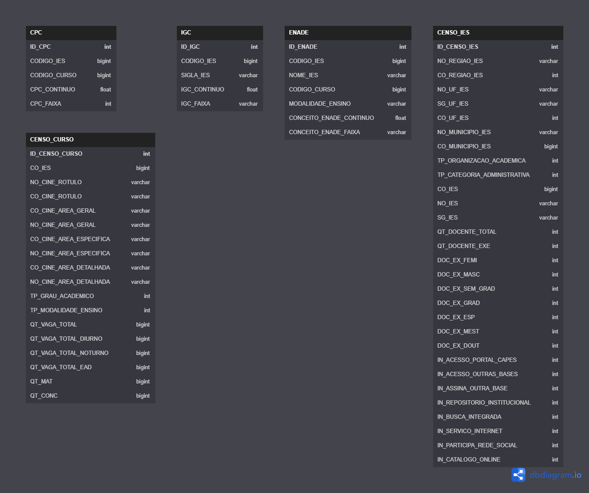

# Consulta Ies

## Descrição
A página Consulta Ies, tem como objetivo mostrar um perfil de informações da instituição de ensino superior solicitada pelo usuário.  Onde o usuário ao utilizar a plataforma vai poder visualizar quais cursos estão sendo lecionados naquela instituição além de informações sobre as notas do MEC atribuídas, e também trazendo textos explicativos sobre o que são esses indicadores de qualidade utilizados pelo MEC.

O objetivo da API é trazer os dados direto da fonte do MEC  fazendo com que a informação apresentada seja diretamente alinhada com a que é avaliada pelo órgão regulador.

## Usuários
* Qualquer pessoa que deseje procurar informações sobre uma instituição de ensino pública ou privada. 

## Funcionalidades
* Buscar e listar instituições pelo nome;
* Informações sobre as notas da instituição;

## Tecnologias Utilizadas:

### Front-End: Angular

### Back-End: Django REST Frameork

### Banco de Dados: SQLITE3

### Modelagem do Banco de Dados:

## Para Executar

### Executando pelo docker-compose
Observação: Importante ter instalado o Docker e Docker-compose

1- Basta clonar o repositorio e acessar a pasta consultaies-FrontEnd 
2- Executar o comando **docker-compose up -d** no console do visualcode ou quaisquer outro console de sistema. 
3- Acessar a ferramenta pelo endereço:
> localhost:4200

## Equipe:
* Abílio Nogueira 
* Gabriel Vinicius
* Tarcísio Costa
